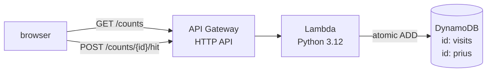

# cloud-visitor-counter

[](https://github.com/vroslmend/cloud-visitor-counter/actions/workflows/deploy.yml)

A small serverless backend that powers the live stats that slide up past the
bottom of [ammarhassan.dev](https://ammarhassan.dev) - built on AWS with
Terraform, in the spirit of the [Cloud Resume Challenge](https://cloudresumechallenge.dev/).

It keeps two counters:

- **`visits`**: total visits to the site
- **`prius`**: how many times the Prius easter egg has been driven

Both live in DynamoDB and are incremented atomically, so concurrent hits never
race each other.

## Architecture



- **DynamoDB** (on-demand) stores the counts, one item per counter.
- **Lambda** reads and increments via an atomic `ADD` expression.
- **API Gateway** (HTTP API) exposes it, with CORS locked to the site's origins.
- **IAM** grants the function least privilege: only `GetItem`/`UpdateItem` on
  this one table, plus permission to write its own logs.
- **Terraform** provisions every piece; tear it all down with one command.

## API

| Method | Path               | Response                      |
| ------ | ------------------ | ----------------------------- |
| `GET`  | `/counts`          | `{ "prius": N, "visits": N }` |
| `POST` | `/counts/{id}/hit` | `{ "<id>": N }`, atomic +1    |

Only `visits` and `prius` are accepted; anything else returns `400`.

## Stack

AWS (Lambda · API Gateway · DynamoDB · IAM) · Terraform · Python · pytest + moto · GitHub Actions (OIDC)

## Tests

The handler is unit-tested with DynamoDB mocked by [moto](https://github.com/getmoto/moto):

```bash
cd lambda
pip install -r requirements-dev.txt
pytest
```

## Continuous deployment

GitHub Actions runs everything; no AWS keys are stored anywhere. Each run
swaps a short-lived GitHub OIDC token for temporary AWS credentials by
assuming a dedicated IAM role that only this repo can assume.

- **Pull requests** ([`ci.yml`](.github/workflows/ci.yml)) run the tests,
  then `terraform fmt`/`validate` and a read-only `plan`, so infra changes
  show up in the PR before anything is applied.
- **Push to `main`** ([`deploy.yml`](.github/workflows/deploy.yml)) run the
  tests, then `terraform apply`.

State lives in S3 (with a native lock object) so local runs and CI share one
source of truth.

## Deploy

Needs AWS credentials configured (`aws configure`) and Terraform ≥ 1.11.

### One-time bootstrap

The S3 state bucket must exist before the first `init`, and the CI role has
to be created once with your own (admin) credentials:

```bash
# 1. create the remote-state bucket (must match versions.tf)
aws s3api create-bucket --bucket portfolio-counter-tfstate-aps1 \
  --region ap-south-1 \
  --create-bucket-configuration LocationConstraint=ap-south-1
aws s3api put-bucket-versioning --bucket portfolio-counter-tfstate-aps1 \
  --versioning-configuration Status=Enabled

# 2. point Terraform at the new backend (copies existing local state up)
cd infra
terraform init -migrate-state

# 3. create the OIDC provider + CI role, then read back the role ARN
terraform apply
terraform output -raw ci_role_arn

# 4. hand that ARN to GitHub Actions as a (non-secret) repo variable
gh variable set AWS_ROLE_ARN -R vroslmend/cloud-visitor-counter --body "<ci_role_arn>"
```

After that, pushes to `main` deploy themselves.

### Day-to-day

```bash
cd infra
terraform apply        # prints the API base URL
terraform destroy      # removes everything when you're done
```

## Cost

Lambda and CloudWatch sit inside the always-free tier at this traffic, and log
retention is capped at 14 days so the log group cannot quietly grow into a
bill. DynamoDB storage is free under 25GB, though on-demand requests are billed
at a fraction of a cent.

API Gateway is the one to watch. Its free allowance runs for 12 months rather
than forever, after which HTTP API requests cost about $1 per million. At
portfolio traffic that is cents a year, but it is not zero.

`infra/budget.tf` sets a monthly budget that mails at $1, so the day this stops
being effectively free arrives as a notification rather than a surprise. It is
account wide, because nothing in this stack carries tags for a cost filter to
match on. Two budgets per account are free.

## Notes

- Visits are counted **once per browser session** by the frontend.
